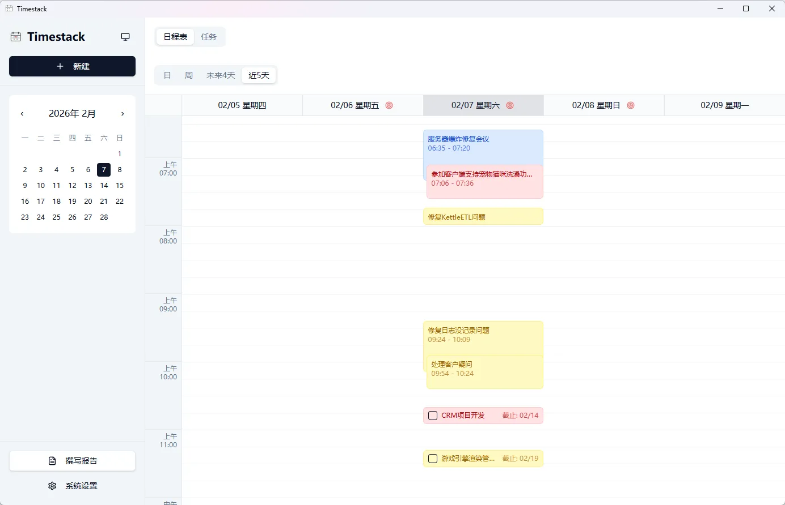

# Timestack

Timestack是一个桌面日程管理应用（Electron + React），支持事件/任务/预约管理、时间轴视图、提醒与AI报告生成。

## 截图



## 功能概览

- **事件** / **任务** / **预约**三类数据管理
- 时间轴视图
- 任务列表查看
- 系统通知预约提醒
- 日报、周报、季度报、年报自动生成，支持OpenAI兼容的LLM接口
- 报告历史记录管理
- 报告手动编辑和保存
- 支持暗色模式

## 技术栈

- 桌面框架：Electron
- 前端框架：React + TypeScript
- 构建工具：Vite
- 状态管理：Zustand
- CSS：Tailwind CSS v4
- 本地数据库：SQLite (better-sqlite3)
- LLM：LangChain

## 项目结构

```
src/
  main/          Electron 主进程（窗口/IPC/数据库）
  preload/       预加载脚本
  components/    UI 组件
  hooks/         自定义 Hooks
  stores/        Zustand 状态
  utils/         工具函数
  types/         类型定义
  styles/        全局样式
docs/            设计文档
dist/            Web 构建产物（生成）
dist-electron/   Electron 构建产物（生成）
```

## 开发与构建

安装依赖。

```bash
npm install
```

启动Electron开发模式。

```bash
npm run electron:dev
```

Electron打包。

```bash
npm run electron:build
```
